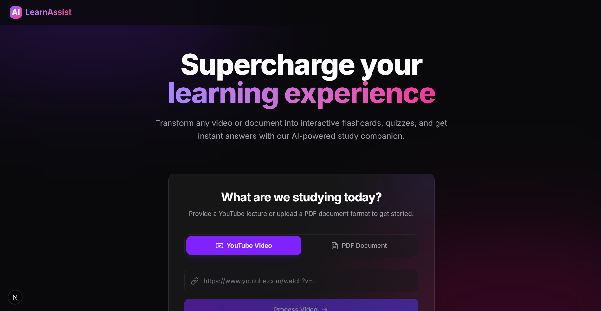
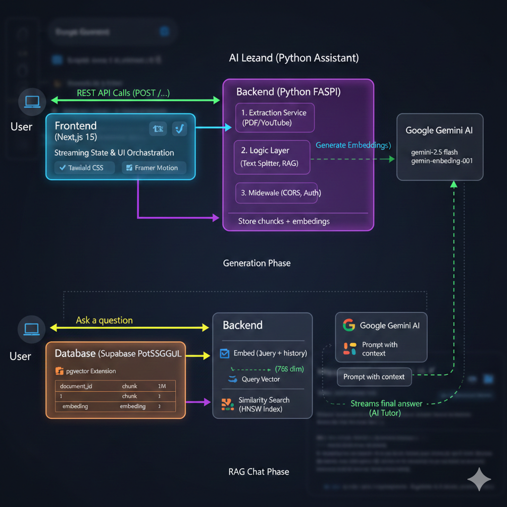

# AI Learning Assistant

An AI-powered Learning Assistant platform where users can input a YouTube URL or upload a PDF to automatically generate interactive flashcards, quizzes, and chat with an AI Tutor using Retrieval-Augmented Generation (RAG).


## Overview & Architecture

This project is built with a modern, high-performance tech stack:
- **Frontend:** Next.js 15 (App Router), Tailwind CSS (v4), Framer Motion, and Lucide React.
- **Backend:** Python FastAPI for asynchronous, high-throughput content processing and generation.
- **AI Model:** Google Gemini (`gemini-2.5-flash` for generation, `gemini-embedding-001` or `text-embedding-004` natively truncated for embeddings).
- **Database/Vector Store:** Supabase PostgreSQL with `pgvector` extension.

### System Architecture Flow



### Core Features
1. **Content Processing:** Extracts text from PDFs and YouTube transcripts, chunks it, embeds it via Gemini, and stores it in Supabase Vector database.
2. **Flashcards & Quizzes:** Uses Gemini structured outputs to instantly generate study materials based on document context.
3. **AI Tutor (RAG Chat):** Chat with the source material through an AI Tutor that streams responses directly to the rich UI.
4. **Stunning UI/UX:** Glassmorphism aesthetics, dynamic dark mode gradients, and delightful micro-animations using Framer Motion.

## Prerequisites
- Node.js (v18+)
- Python (v3.10+)
- Supabase Project with `pgvector` enabled
- Google Gemini API Key

## Setup Guide

### 1. Supabase Initialization
Run the SQL script located in `backend/supabase_schema.sql` in your Supabase project's SQL Editor to set up the necessary tables and vector search RPC functions.

### 2. Backend Setup (FastAPI)
```bash
cd backend
python -m venv venv
# Activate virtual environment:
# Windows: .\venv\Scripts\activate
# Mac/Linux: source venv/bin/activate

pip install -r requirements.txt
```
Create a `.env` file in the `backend` directory:
```env
SUPABASE_URL=your_supabase_url
SUPABASE_KEY=your_supabase_anon_or_service_key
GEMINI_API_KEY=your_google_gemini_api_key
```
Run the backend server:
```bash
uvicorn main:app --reload
```
API running on `http://localhost:8000`.

### 3. Frontend Setup (Next.js)
```bash
cd frontend
npm install
npm run dev
```
Dashboard running on `http://localhost:3000`.
